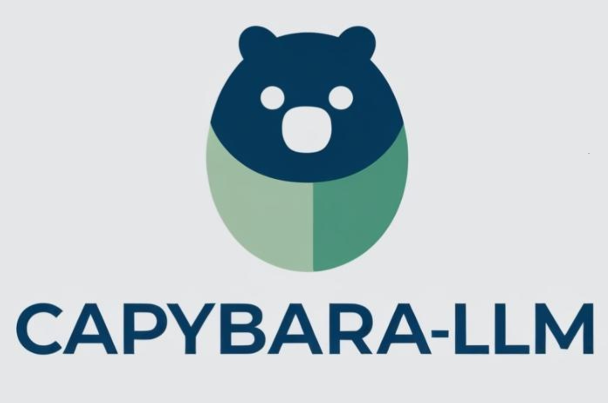

# 🦫 Capybara-LLM: A Chill but Powerful Lightweight LLM for Edge AI

Capybara-LLM is a lightweight yet powerful large language model (LLM) specifically designed for Edge AI applications. Unlike traditional LLMs that require extensive computational resources, Capybara-LLM is optimized for low-power, resource-constrained devices, making it an ideal choice for on-device inference in edge environments.

Key Features:
Efficient & Lightweight: Designed to operate efficiently on edge devices with limited processing power and memory.
Optimized for Attention Mechanisms: Uses optimized attention mechanisms to enhance performance while maintaining a low computational footprint.
Low Latency Inference: Enables real-time decision-making without relying on cloud resources.
Privacy-Preserving: Runs locally on edge devices, ensuring that sensitive data remains private.
Scalable & Customizable: Supports fine-tuning and adaptation for various edge AI applications, from IoT to robotics.

Use Cases:
Smart Devices & IoT: AI-driven automation and decision-making on embedded devices.
Autonomous Systems: Robotics, drones, and self-driving technologies.
Healthcare & Wearables: Real-time processing for medical diagnostics and monitoring.
Industrial AI: Predictive maintenance and anomaly detection in manufacturing.
Capybara-LLM represents a chill but powerful approach to edge AI, balancing efficiency, adaptability, and performance to bring LLM capabilities to the edge. 🚀🐾
